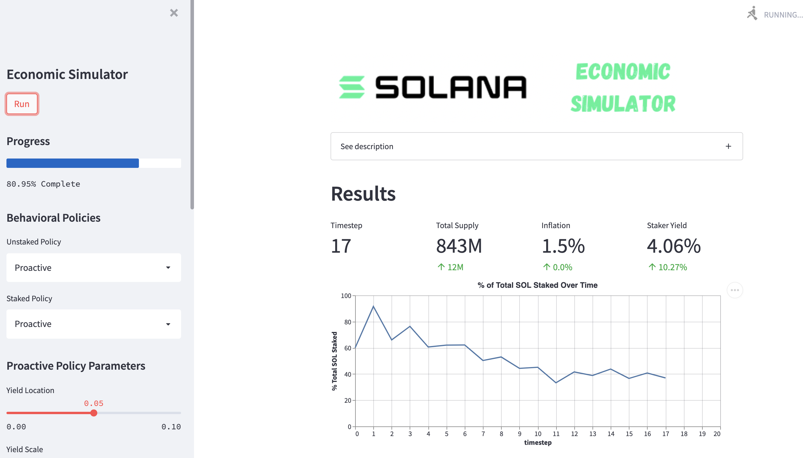

# Solana Economic Simulation

In Solana, new SOL are minted on a given inflation schedule. These SOL are then distributed to those who "stake" their existing coins: participating in, or delegating to a validator who participates in, the validator of transactions on the Solana blockchain.

In this vein, staking SOL has a positive, dynamic yield. Conversely, the value of unstaked SOL is continuously diluted.

For more information on this system, please refer to the [Solana Economics Overview](https://docs.solana.com/economics_overview).

## Web App

A web app for this simulation can be found [here](https://share.streamlit.io/cavaunpeu/solana-economics/main/app/main.py).

It looks like:

## Tools

This simulation was built with [cadCAD](https://github.com/cadCAD-org/cadCAD), and the dashboard with [Streamlit](https://github.com/streamlit/streamlit).
